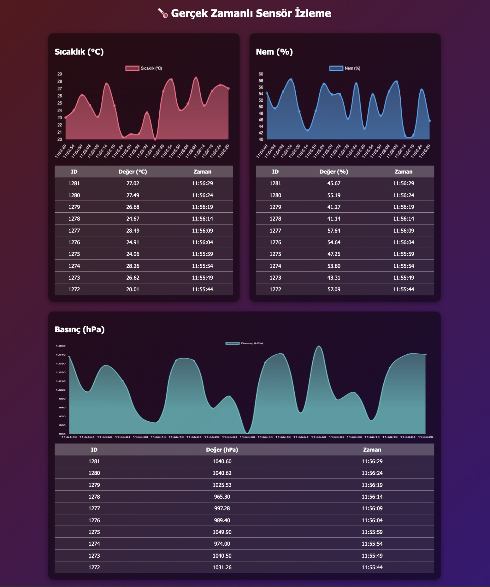

# Gerçek Zamanlı Sensör İzleme (Go + WebSocket + PostgreSQL)

Bu proje, **Go (Golang)**, **PostgreSQL**, **WebSocket** ve **Chart.js** kullanarak **gerçek zamanlı sensör verilerini izleme** uygulamasıdır.  
Sahte (fake) veriler ile çalışır, ancak kolayca gerçek sensörlerden veri alacak şekilde uyarlanabilir.



---

## Özellikler
- **Go Backend**:
  - PostgreSQL veritabanı bağlantısı
  - REST API (son 50 veri ve son veri)
  - WebSocket ile gerçek zamanlı veri yayını
- **3 Sensör Takibi**:
  - Sıcaklık (°C)
  - Nem (%)
  - Basınç (hPa)
- **Frontend (HTML + JS + Chart.js)**:
  - Canlı güncellenen grafikler
  - Son 10 veriyi gösteren tablolar
  - Gradient renkli modern arayüz

---

## Kurulum

### 1. PostgreSQL Kur ve Başlat
Eğer Mac kullanıyorsan:
```bash
brew install postgresql
brew services start postgresql

Veritabanı ve tabloyu oluştur:
CREATE DATABASE testdb;

\c testdb

CREATE TABLE temperature_data (
    id SERIAL PRIMARY KEY,
    value DOUBLE PRECISION,
    created_at TIMESTAMP DEFAULT CURRENT_TIMESTAMP
);

CREATE TABLE humidity_data (
    id SERIAL PRIMARY KEY,
    value DOUBLE PRECISION,
    created_at TIMESTAMP DEFAULT CURRENT_TIMESTAMP
);

CREATE TABLE pressure_data (
    id SERIAL PRIMARY KEY,
    value DOUBLE PRECISION,
    created_at TIMESTAMP DEFAULT CURRENT_TIMESTAMP
);

### 2. Projeyi Çalıştır

# Bağımlılıkları yükle
go mod tidy

# Uygulamayı başlat
go run .

Tarayıcıdan: 
http://localhost:8080
Canlı grafikler ve tablolar görüntülenir.


